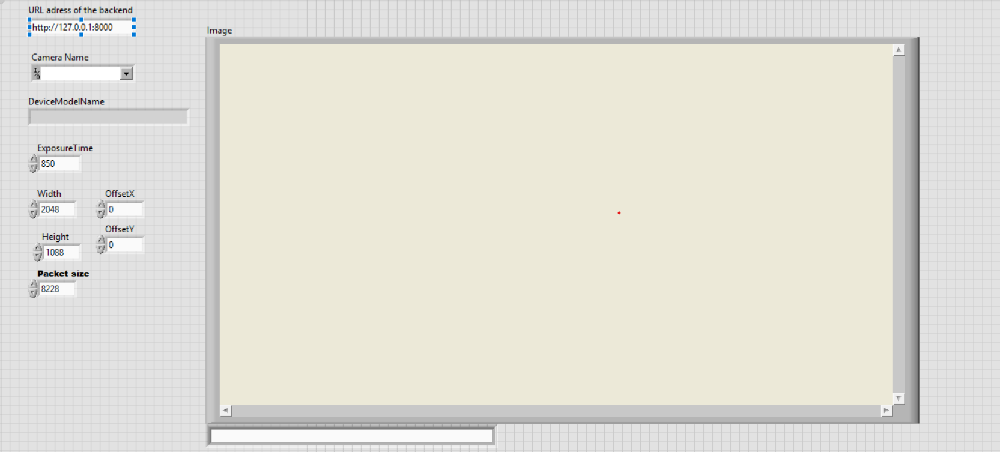

# Programátorská příručka

Tento projekt se dělí na tři hlavní složky: `backend`, `frontend` a `labview`.
Více informací je uvedeno v [README](../../../README.md), kde je popsán celý technologický stack.

## Obsah

- [Lokální vývoj](#lokální-vývoj)
  - [Databáze](#databáze)
  - [Backend](#backend)
  - [Frontend](#frontend)
  - [docker-compose](#docker-compose)
  - [LabVIEW](#labview)

## Lokální vývoj

### Databáze

Nejprve je nutné sestavit a spustit Postgres databázi. Lze to udělat dvěma způsoby: [lokálně nainstalovat](https://www.postgresql.org/download/) nebo použít Docker.
V obou případech je nutné nastavit proměnné `PGDATA`, `POSTGRES_DB`, `POSTGRES_USER` a `POSTGRES_PASSWORD` (jejich hodnoty jsou v souboru `docker-compose.yml`).

V případě Dockeru je nutné použít následující příkaz:

```bash
docker run --name soad-db -p 5002:5432
-e PGDATA=/var/lib/postgresql/data/db-files/ 
-e POSTGRES_DB=soad  
-e POSTGRES_USER=api 
-e POSTGRES_PASSWORD=changeit 
-v database_volume:/var/lib/postgresql/data/ postgres:17-alpine

# V případě, že neexistuje volume
docker volume create database_volume
```

Je možné také jít cestou docker-compose:

```bash
# Pozor: udělá build všech služeb z .yml (backend, frontend, database)
docker-compose build
docker-compose up database
```

Po spuštění výše uvedených příkazů by se měla vytvořit databáze s názvem `soad`, kam se budou ukládat veškerá měření. 
Postgres by měl běžet na portu `5002` a být připraveným k akceptaci dotazů.

### Backend

Po spuštění databáze můžeme připravit backend. Je nutné mít nainstalovaný interpret jazyka [Python](https://www.python.org/downloads/) (verze >=3.11). 
Lze použít i docker-compose, ale po každé změně ve zdrojovém kódu bude potřeba vytvořit nový image backendu.

Zpočatku vytvoříme virtuální prostředí a nainstalujeme závislosti. Na macOS/Linux:
```bash
# soad/backend/
python3 -m venv venv

source venv/bin/activate

python3 -m pip install --upgrade pip

pip3 install -r requirements.txt
```

Na Windows:

```shell
# soad/backend/
# Občas py nefunguje (záleží na instalaci), zkusit python3
py -m venv venv

venv\Scripts\activate

py -m pip install --upgrade pip

pip install -r requirements.txt
```

Dále je nutné přidat soubor `.env`. Záleží na přání vývojáře, jak ho vyplní, ale ukázkové nastavení enviromentálních 
proměnných je možné nalézt v `soad/backend/.env.example`.

Poté můžeme spustit `main.py` soubor:

```bash
fastapi dev src/main.py
```

Po krátké době se vytvoří FastAPI aplikace a poběží na adrese [http://localhost:5001](http://localhost:5001).

Na [http://localhost:5001/docs](http://localhost:5001/docs) poběží Swagger dokumentace s popisem endpointů.

### Frontend

Nutnou podmínkou pro FE je nainstalovaný [Node.js](https://nodejs.org/en/download). Dále je nutné přidat nezbytné závislosti:

```bash
# soad/frontend/
npm install
```

Podobně jako u backendu je potřeba přidat soubor `.env` a vyplnit jej. Ukázkové nastavení se nachází v 
`soad/frontend/.env.example`. Následně je potřeba spustit Vite dev server:

```bash
npm run dev
```

Aplikace by měla poběžet na adrese [http://localhost:5000](http://localhost:5000).

### docker-compose

Pro otestování aplikace v kontejnerech je nutné spustit níže uvedené příkazy:

```bash
docker-compose build
docker-compose up

# Vypne kontejnery
docker-compose down
```

### LabVIEW

Postačí jakákoliv stabilní verze [LabVIEW](https://www.ni.com/en/support/downloads/software-products/download.labview.html#559067), která poběží na laboratorním PC. 
MS musí být připojena přes **Gigabit Ethernet** a v operačním systému musí být na rozhraní síťové karty nastavena maximální velikost jumbo packetů.

Po připojení kamery je potřeba otevřít `labview/` v LabVIEW prostředí.
V tomto adresáři se nachází `LabVIEW 2012/` (nutný toolkit), `lv_gige/` (LabVIEW projekt) a `labview-control/` (FastAPI aplikace).

Před spuštěním je nutné nastavit parametry kamery. Níže je příklad:



- **URL address of the backend** - adresa BE, kam LabVIEW bude posílat GET dotaz
- **Path** - cesta k obrázku, který pořídí kamera
- **CameraName** - musí být vybrána připojená MS
- **Width & Height** - musí odpovídat hodnotám, které jsou v DeviceModelName (zde například D2048x1088)
- **Packet size** - musí být nastaven na hodnotu **8228**

Teprve teď můžeme spustit LabVIEW kód a FastAPI aplikaci v `labview-control/`. LabVIEW bude každou sekundu vysílat HTTP GET dotaz 
a pokud dostane hodnotu `1`, tak se pořídí snímek, jinak čeká. Dotaz je vysílán na FastAPI aplikaci.
